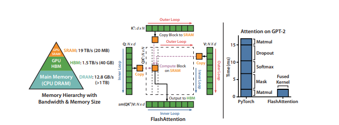

Dao et al. (NeurIPS 2022) proposes FlashAttention, a fast and memory-efficient exact attention mechanism with IO-awareness. FlashAttention is designed to optimize memory access patterns and reduce redundant computation, making it significantly faster and more efficient than conventional attention mechanisms. Unlike standard attention, which processes attention scores inefficiently in memory, FlashAttention leverages tiling and recomputation to minimize memory usage while maintaining exact attention computation.

